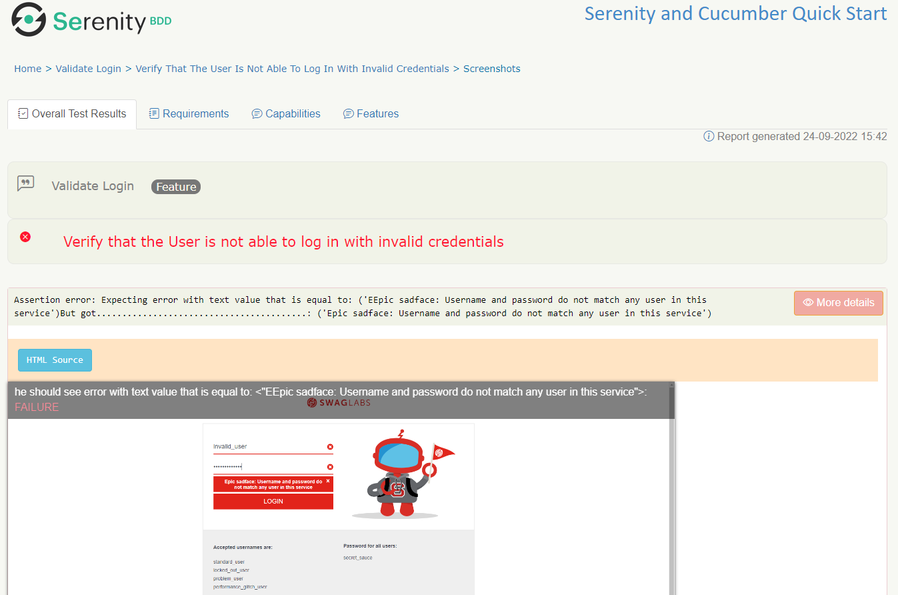

### README PLEASE
# Serenity project - testing QA
## Hi there! 😄

This is a framework which contains test cases for testing website 'Swag Labs'.
In this project I used serenity bdd with selenium, cucumber, junit.

## Get the code

Git:
git clone https://github.com/Tusuegra510/qa.automation.framework.git

Or simply [download a zip](https://github.com/Tusuegra510/qa.automation.framework.git) file.

### The project directory structure
The project has build scripts for both Maven and Gradle, and follows the standard directory structure used in most Serenity projects:
```Gherkin
src
  + test
    + java                        Test runners and supporting code
    + resources
      + features                  Feature files
    + search                  Feature file subdirectories
             search_by_keyword.feature
Testing QA                          test cases and supporting evidences
```

# Understanding the project...🤓
## 🗂 Folder Testing QA
- In this folder you can see the all documentation about manual testing like test cases and evidence with each test executed and if these pass or not.

## 🗂 Folder and package test / java / starter
### runner
- to run test cases
### stepsdefinitions
- steps by actor and connecting directly with the file .feature
### login
- methods to do some actions with the elements of the website.
### navigation
- methods to navigate to a site.

## 🗂 Folder resources
### features - login
- In the folder features you can search the test suite where are the test-cases written in gherkin language.
### serenity.config
- file to set some options like chrome, environments, etc

## 🗂 Folder target
- This folder is generated when we run the command 'mvn clean verify' and it generates reports in html format and saves these files in this folder


## Gherkin scenario
This project uses Cucumber scenario. In this scenario, Sebastian (who likes to search for products) is performing a search on the Swag Labs page:

```Gherkin
Feature: Validate login

  Background:
    Given Sebastian is researching products on the Sauce Labs page

  Scenario: Verify if a standard user is able to login by entering valid credentials and clicking on the 'Login' button.
    When he login with valid credentials. Username: "standard_user" Password: "secret_sauce"
    Then he should see a section about "PRODUCTS"
```

### The Screenplay implementation
This project uses the Screenplay pattern. The Screenplay pattern describes tests in terms of actors and the tasks they perform. Tasks are represented as objects performed by an actor, rather than methods. This makes them more flexible and composable, at the cost of being a bit more wordy. Here is an example:
```java
@Given("{actor} is researching products on the Sauce Labs page") 
public void researchingProducts(Actor actor) {
		actor.wasAbleTo(NavigateTo.theSauceDemoHomePage());
		}

@When("{actor} login with valid credentials. Username: {string} Password: {string}")
public void loginToPage(Actor actor, String username, String password) {
		actor.attemptsTo(
		performLogin.about(username, password)
		);
		}

@Then("{actor} should see a section about {string}")
public void should_see_information_about(Actor actor, String term) {
		actor.attemptsTo(
		Ensure.that(productSection.HEADING).hasText(term)
		);
		}
```

Screenplay classes emphasise reusable components and a very readable declarative style, whereas Lean Page Objects and Action Classes opt for a more imperative style.

The `NavigateTo` class is responsible for opening the Saucedemo home page:
```java
public class NavigateTo {
	public static Performable theSauceDemoHomePage() {
		return Task.where("{0} opens the SauceDemo home page",
				Open.browserOn().the(SauceDemoHomePage.class));
	}
}
```

The `PerformLogin` class does the actual login:
```java
public class PerformLogin {
	public static Performable about(String username, String password) {
		return Task.where("{0} login with valid credentials",
				Enter.theValue(username)
						.into(LoginBox.USERNAME_FIELD),
				Enter.theValue(password)
						.into(LoginBox.PASSWORD_FIELD)
						.thenHit(Keys.ENTER)
		);
	}
}
```

In Screenplay, we keep track of locators in light weight page or component objects, like this one:
```java
class LoginBox {
	static Target USERNAME_FIELD = Target.the("user-name").locatedBy("#user-name");
	static Target PASSWORD_FIELD = Target.the("password").locatedBy("#password");
}
```

## Executing the tests
To run the project, you can either just run the `Runner` test runner class, or run either `mvn verify` or `gradle test` from the command line.

By default, the tests will run using Chrome. You can run them in Firefox by overriding the `driver` system property, e.g.
```json
$ mvn clean verify -Ddriver=firefox
```
Or
```json
$ gradle clean test -Pdriver=firefox
```

The test results will be recorded in the `target/site/serenity` directory.

## Generating the reports
Since the Serenity reports contain aggregate information about all of the tests, they are not generated after each individual test (as this would be extremenly inefficient). Rather, The Full Serenity reports are generated by the `serenity-maven-plugin`. You can trigger this by running `mvn serenity:aggregate` from the command line or from your IDE.

After you run your test and use `mvn serenity:aggregate` you can find the reports on index.html located in the `target/site/serenity` directory. Screenshots will be taken only when test fails (but you can change this behaviour on `serenity.properties`). Navigate to Test Results and click on the Scenario that has failed.

You should see a report like this sample:


The reports are also integrated into the Maven build process: the following code in the `pom.xml` file causes the reports to be generated automatically once all the tests have completed when you run `mvn verify`?

```
             <plugin>
                <groupId>net.serenity-bdd.maven.plugins</groupId>
                <artifactId>serenity-maven-plugin</artifactId>
                <version>${serenity.maven.version}</version>
                <configuration>
                    <tags>${tags}</tags>
                </configuration>
                <executions>
                    <execution>
                        <id>serenity-reports</id>
                        <phase>post-integration-test</phase>
                        <goals>
                            <goal>aggregate</goal>
                        </goals>
                    </execution>
                </executions>
            </plugin>
```

## Simplified WebDriver configuration and other Serenity extras
This project uses the `serenity.conf` file in the `src/test/resources` directory to configure test execution options.  
### Webdriver configuration
The WebDriver configuration is managed entirely from this file, as illustrated below:
```java
webdriver {
    driver = chrome
}
headless.mode = false

chrome.switches="""--start-maximized;--test-type;--no-sandbox;--ignore-certificate-errors;
                   --disable-popup-blocking;--disable-default-apps;--disable-extensions-file-access-check;
                   --incognito;--disable-infobars,--disable-gpu"""

```

Serenity uses WebDriverManager to download the WebDriver binaries automatically before the tests are executed.

### Environment-specific configurations
We can also configure environment-specific properties and options, so that the tests can be run in different environments. Here, we configure three environments, __dev__, _staging_ and _prod_, with different starting URLs for each:
```json
environments {
  default {
    webdriver.base.url = "https://duckduckgo.com"
  }
  dev {
    webdriver.base.url = "https://duckduckgo.com/dev"
  }
  staging {
    webdriver.base.url = "https://duckduckgo.com/staging"
  }
  prod {
    webdriver.base.url = "https://duckduckgo.com/prod"
  }
}
```

You use the `environment` system property to determine which environment to run against. For example to run the tests in the staging environment, you could run:
```json
$ mvn clean verify -Denvironment=staging
```